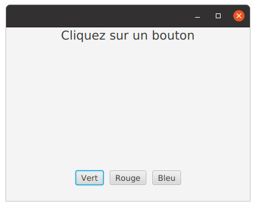
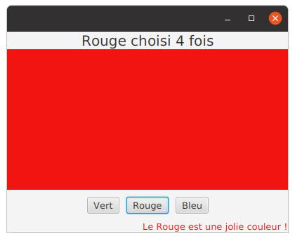
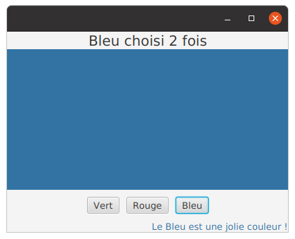

# 
# Développement d’applications avec IHM

### IUT Montpellier-Sète – Département Informatique

* [**Support de cours**](https://gitlabinfo.iutmontp.univ-montp2.fr/ihm/ressources)
* **Enseignants:**
    * [Sophie Nabitz](mailto:sophie.nabitz@univ-avignon.fr),
      [Cyrille Nadal](mailto:cyrille.nadal@umontpellier.fr),
      [Nathalie Palleja](mailto:nathalie.palleja@umontpellier.fr),
      [Xavier Palleja](mailto:xavier.palleja@umontpellier.fr),
      [Petru Valicov](mailto:petru.valicov@umontpellier.fr)
    * [Nihal Ouherrou](mailto:nihal.ouherrou@umontpellier.fr) -- responsable de la partie _Ergonomie_ du cours,
* [Email](mailto:petru.valicov@umontpellier.fr) pour une question d'ordre privée concernant le cours.

## TP 2 : gestionnaires d'événement et propriétés

Tout au long du TP, vous aurez certainement besoin de **consulter les pages de documentation** de JavaFX, qui sont [disponibles ici](https://openjfx.io/javadoc/17/).

Le but de ce TP est de vous familiariser avec la notion de [**Propriété**](https://wiki.openjdk.java.net/display/OpenJFX/JavaFX+Property+Architecture) en JavaFX. Pour un objet donné, les propriétés définissent son état accessible en lecture/écriture, et qui de plus, peut être _observé_ lors de son changement. 

La notion sœur de propriété et la notion de [**binding**]. Il s'agit d'une valeur (donnée) **X** qui est liée à un certain nombre de valeurs observables **x1, x2, x3...** : si un changement d'une des valeurs observables a lieu, alors **X** est automatiquement recalculé. Toutes les classes de propriétés de JavaFX permettent la création des bindings.

### Exercice 1 - Premières propriétés et bindings simples

On reprend l'exercice 2 du premier TP qui change la couleur d'un panneau et affiche combien de fois un bouton a été cliqué. Mais cette fois-ci nous allons complexifier un peu le comportement des éléments de la fenêtre. Désormais il faudrait que les clics changent également le texte et la couleur d'un label situé tout en bas de la fenêtre.

  

1. Associez à chacun des trois boutons, 3 événements avec la méthode de convenance `setOnAction(event -> ...)`. 

2. Ajoutez à la classe un attribut `nbFois` de classe `IntegerProperty` et instanciez-le dans un constructeur en utilisant la classe concrète `SimpleIntegerProperty`. Cette **propriété** devra changer dynamiquement en fonction du bouton cliqué et du nombre de clics. Changez le code de vos gestionnaires d'événement de façon à utiliser la propriété `nbFois` lors de l'affectation du texte du label `texteDuHaut`.

3. Ajoutez maintenant un attribut `message` de classe `StringProperty`, instanciez-le dans le constructeur en utilisant `SimpleStringProperty`. Dans les gestionnaires d'événement, ce message sera affecté au texte du `Button`.

4. Transformez l'affectation du texte du label `texteDuHaut` en un **binding** sur la propriété `Text` du label et déplacez ce nouveau code à l'extérieur du gestionnaire d'événement. Vous utiliserez la méthode statique `concat(...)` de la classe [`Bindings`](https://openjfx.io/javadoc/17/javafx.base/javafx/beans/binding/Bindings.html) (pour concaténer un nombre variable de chaînes de caractères), et la méthode `asString()` (pour lier avec une `String` correspondant à une expression numérique). Pour l'instant, ne vous préoccupez pas de l'état initial du `Label`.

5. De même, déclarez un attribut `couleurPanneau` de classe `StringProperty`. Vous l'instancierez comme ceci : `couleurPanneau = new SimpleStringProperty("#000000");`.
 Mettez à jour l'objet `couleurPanneau` dans le gestionnaire d'événement en utilisant (uniquement) la valeur de la couleur correspondante au bouton choisi, et enfin ajoutez un binding sur la propriété `Style` du panneau.

7. Extrayez les deux instructions de binding dans une méthode privée `createBindings()`. Dans cette méthode, déclarez et instanciez une variable `pasEncoreDeClic` de type `BooleanProperty`. Liez cette variable de façon à ce qu'elle change lorsque `nbFois` n'est plus égal à 0. Pour cela, retrouvez la version appropriée de la méthode `equal()` de `Bindings`. Transformez ensuite le binding sur le label `texteDuHaut` afin de gérer sa valeur initiale en utilisant `Bindings.when`.

8. **Sans toucher au code** des gestionnaires d'événement de vos boutons, faites en sorte que le label `texteDuBas` affiche le texte en fonction de `message` et de `couleurPanneau`. Par exemple, si le bouton *Rouge* a été cliqué, le texte de `texteDuBas` devrait être colorié en rouge et afficher "*Le Rouge est une jolie couleur !*".

### Exercice 2 - Écouteur de changement

On continue de travailler sur la palette, mais à partir d'un code initial un peu différent. Consultez les fichiers `Palette.java` et `CustomButton.java`.

1. Ajoutez dans la classe `CustomButton` les 3 méthodes usuelles pour la propriété `nbClics` (pensez à utiliser les facilités de votre IDE...). Ajoutez aussi la méthode `getCouleur()`.

2. Ajoutez, dans le gestionnaire d'événement de la classe `Palette`, le code qui incrémente le nombre de clics du bouton qui a reçu l'événement. 

3. Définissez un attribut `nbClicsListener` de type [`ChangeListener<Number>`](https://openjfx.io/javadoc/17/javafx.base/javafx/beans/value/ChangeListener.html) et implémentez-le dans la méthode `start()` (de la classe `Palette`) de façon à actualiser le label `texteDuHaut` et le style du panneau. Pour vous guider, remarquez que l'interface `ChangeListener<T>` est une interface fonctionnelle de JavaFX, sa seule fonction abstraite étant `changed(ObservableValue<? extends T> obsevée, T ancienneValeur, T nouvelleValeur)`. Le paramètre `observée` correspond à la source à laquelle l'écouteur sera associée, les deux autres paramètres étant la valeur actuelle de la source et la nouvelle valeur à utiliser. 

   Associez cet écouteur de changement à la propriété `nbClics` de chacun des 3 boutons.

4. Modifiez l'implémentation de la méthode `changed(...)` de `nbClicsListener` afin de modifier également le label `texteDuBas` (avec le même effet que dans l'exercice précédent).

### Exercice 3 - Liste observable

Dans le fichier `MainPersonnes.java`, on va travailler avec une liste de personnes `lesPersonnes` qui peut évoluer, par ajout, suppression et modification d'éléments. Observez la déclaration et l'instanciation de cette liste, objet qui est une propriété `Observable`, ce qui signifie qu'on pourra y attacher des écouteurs, ou la lier à d'autres propriétés.

1. Dans cette question, vous allez compléter la ligne 18 du fichier `MainPersonnes.java`, de façon à définir un écouteur de changement sur la liste `lesPersonnes`. 
[ListChangeListener](https://openjfx.io/javadoc/17/javafx.base/javafx/collections/ListChangeListener) est une interface fonctionnelle dont la méthode à implémenter n'a qu'un argument. Cet argument, de type [ListChangeListener.Change](https://openjfx.io/javadoc/17/javafx.base/javafx/collections/ListChangeListener.Change.html), permet d'accéder aux informations des éléments qui ont changé dans la liste. Pour pouvoir exploiter un changement, il faut (au moins une fois) exécuter la méthode `next()` sur cet argument, et ensuite, suivant le type de changement, utiliser différentes méthodes. 
Pour savoir quel type de changement a eu lieu, vous pouvez utiliser des méthodes booléennes comme `wasAdded()`, `wasRemoved()` et `wasUpdated()`. 
On peut aussi utiliser la méthode `getAddedSubList()` qui retourne la liste de tous les éléments ajoutés.

Pour l'instant, votre code ne traitera qu'un seul ajout à la fois, et se contentera d'afficher "_Pierre a été ajouté_" (quand la personne dont le nom est "_Pierre_" a été ajouté...).
Invoquez la méthode `question1()` pour voir le résultat.

2. On continue avec la suppression d'une personne de la liste, avec un code, à ajouter à l'existant, qui utilise maintenant `getRemoved()` et qui affiche "Pierre a été enlevé". Testez en remplaçant le précédent appel par celui de la méthode `question2()`.

3. Écrivez maintenant un code qui devrait réagir à une modification de l'âge en écrivant "Pierre a maintenant ... ans", et testez en appelant maintenant `question3()`. Vous devriez constater que l'écouteur ne réagit pas...

4. Transformez maintenant l'instanciation de la liste par `FXCollections.observableArrayList(personne -> new Observable[] {personne.ageProperty()});`, qui permet d'exprimer que l'on souhaite écouter les changements sur la propriété *age* de la classe `Personne`. Modifiez le code dans `Personne.java` en conséquence pour pouvoir compiler et testez à nouveau avec `question3()`.

5. Ajoutez un second écouteur sur la liste *plusieursChangementsListener* qui, cette fois, gère plusieurs changements à la fois et testez avec la méthode `question5()`. Vous pouvez constater que le listener est déclenché plusieurs fois dans le cas d'une modification de l'âge (par exemple en ajoutant un affichage en fin du code du listener).

### Exercice 4 - Low-level binding

On souhaite maintenant faire calculer automatiquement l'âge moyen des personnes dans la liste *lesPersonnes*. Consultez la nouvelle version des classes qui vous sont fournies.

1. Écrivez un binding *calculAgeMoyen*, dont vous vous servirez pour que l'attribut *ageMoyen* soit actualisé au fur et à mesure des modifications de la liste *lesPersonnes*. Vous compléterez la classe `Personne` avec les méthodes dont vous pourriez avoir besoin, ainsi que le code de la fonction `main`, avant de tester avec la méthode `question1()`.

2. Écrivez un second binding *calculNbParisiens*, qui permettra de connaitre, grâce à l'attribut *nbParisiens*, le nombre de personnes nées à Paris. Testez ensuite avec la méthode `question2()`.

### Exercice 5 - Bindings

On reprend l'exercice du précédent TP qui affiche une interface de login. 
Complétez la méthode `createBindings()` afin que :
- le champ du mot de passe ne soit pas éditable si le nom de l'utilisateur fait moins de 6 caractères,
- le bouton `cancel` ne soit pas cliquable si les deux champs sont vides,
- le bouton `ok` ne soit pas cliquable tant que le mot de passe n'a pas au moins 8 caractères, et ne contient pas au moins une majuscule et un chiffre.